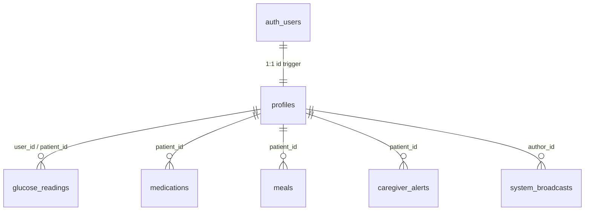

# SugarSense AI — Database Setup & Supabase Migration Guide

This directory contains the production-ready PostgreSQL schema, Row-Level Security (RLS) policies, and seed data for **SugarSense AI**.

---

## 📁 Files in this Directory

| File | Purpose |
| :--- | :--- |
| **`schema.sql`** | Table definitions, foreign key constraints, indexes, and automatic profile creation triggers. |
| **`policies.sql`** | Row Level Security (RLS) policies and `supabase_realtime` publication setup. |
| **`seed.sql`** | Initial calibration profiles, default Indian diabetes medications, and sample glucose logs. |

---

## 🚀 How to Execute Migrations in Supabase

1. Open your **[Supabase Project Dashboard](https://supabase.com/dashboard)**.
2. Navigate to the **SQL Editor** from the left navigation menu.
3. Open or copy the contents of **`schema.sql`** and click **Run**.
4. Open or copy the contents of **`policies.sql`** and click **Run**.
5. (Optional) Run **`seed.sql`** to bootstrap sample health telemetry for `patient-senior-101`.

---

## 🛡️ Database Architecture Overview

### Table Summary:
- **`public.profiles`**: Extends `auth.users` with user roles (`SENIOR`, `CAREGIVER`, `DOCTOR`, `ADMIN`), patient identifier, and metadata.
- **`public.glucose_readings`**: High-frequency glucose telemetry records with meal tags, trend, and deviation status.
- **`public.medications`**: Real-time medication schedules, dosages, criticality (`CRITICAL` vs `STANDARD`), and multilingual instructions.
- **`public.meals`**: Logged Indian diet items, estimated carbohydrate load, and glycemic index classifications.
- **`public.caregiver_alerts`**: Emergency and compound risk notifications with acknowledgment timestamps.
- **`public.system_broadcasts`**: System-wide notifications with target role filtering (`ALL`, `SENIOR`, `CAREGIVER`, `DOCTOR`) and urgency levels (`INFO`, `WARNING`, `CRITICAL`).
